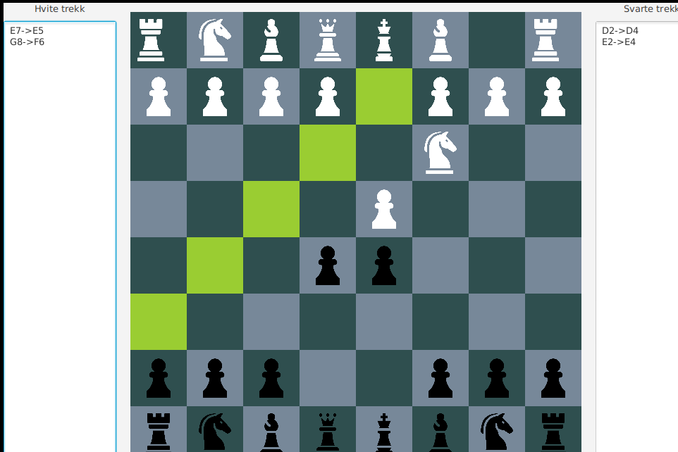

# Sjakk-ish

Et sjakkinspirert spill for to spillere, laget i Java med JavaFX. Prosjektet er laget individuelt i emnet TDT4100 Objektorientert programmering ved NTNU, våren 2026.



## Om spillet

Sjakk-ish følger hovedreglene i sjakk: Hver brikke har sine egne lovlige trekk, brikkene kan slå hverandre, og den som først slår motstanderens konge, vinner. To spillere spiller mot hverandre på samme maskin.

Noen regler er bevisst utelatt for å holde spillet enkelt – derav navnet. Spillet har ikke regelen om at kongen står i sjakk, rokade eller andre spesialregler.

## Funksjoner

- Grafisk sjakkbrett i JavaFX der mulige trekk lyses opp når du klikker på en brikke
- Validering av trekk og turbytte mellom hvit og svart
- Spillet avsluttes og vinneren vises når en konge er slått
- Alle trekk lagres fortløpende til fil med sjakkoordinater (for eksempel `E2->E4`), én fil per spiller, og vises i en liste ved siden av brettet

## Oppbygning

- `Brikke` er en abstrakt klasse, og hver brikketype (`Pawn`, `Rook`, `Horse`, `Bishop`, `Queen`, `King`) er en subklasse som selv regner ut sine lovlige trekk.
- `Board` holder styr på brettets 64 ruter og utfører selve trekkene.
- `ChessGame` implementerer grensesnittet `ChessRules` og styrer spillets gang: hvem sin tur det er, om et trekk er gyldig og om spillet er over.
- `Position` validerer at en posisjon ligger på brettet.
- `ChessFileHandler` gjør om posisjoner til sjakkoordinater og skriver trekkene til fil.
- `ChessController` kobler modellen sammen med brukergrensesnittet (FXML).

## Testing

Prosjektet har enhetstester skrevet med JUnit 5 (`src/test/java/Chess/ChessTest.java`). Testene dekker startoppstillingen på brettet, at hvit starter og at spillerne bytter på, at bonden bare kan gå to steg i første trekk, validering av posisjoner utenfor brettet og lagring av trekk til fil.

Testene er konsentrert rundt `ChessGame`, siden det er klassen som bruker alle de andre.

## Kjøre prosjektet

Krever Java 21 og Maven.

```bash
mvn javafx:run
```

Kjøre testene:

```bash
mvn test
```

Appen kan også startes ved å kjøre `ChessApp.java` direkte fra VS Code.

## Videre arbeid

- Legge til regelen om sjakk og rokade, for eksempel i en utvidet spillklasse
- Flytte mer logikk ut av kontrolleren for et tydeligere skille mellom modell, visning og kontroller (MVC)
- Flere tester for enkeltbrikkenes trekk

---

Laget av Zofia Czulinska
